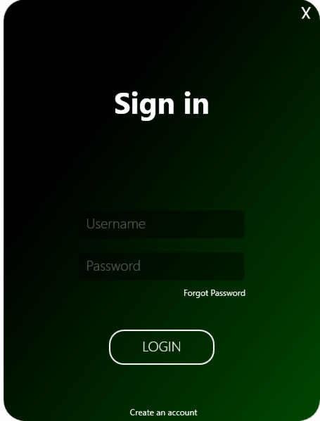
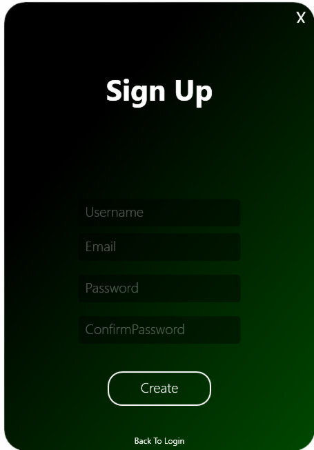

# Registration and Login UI

This project contains user interface (UI) for registration and login forms in a .NET 8 application. 
The interface is created using XAML language in WPF (Windows Presentation Foundation) technology.

## Running the Project

To run the project, open the solution (.sln) in Visual Studio and run the application.

## Samples

